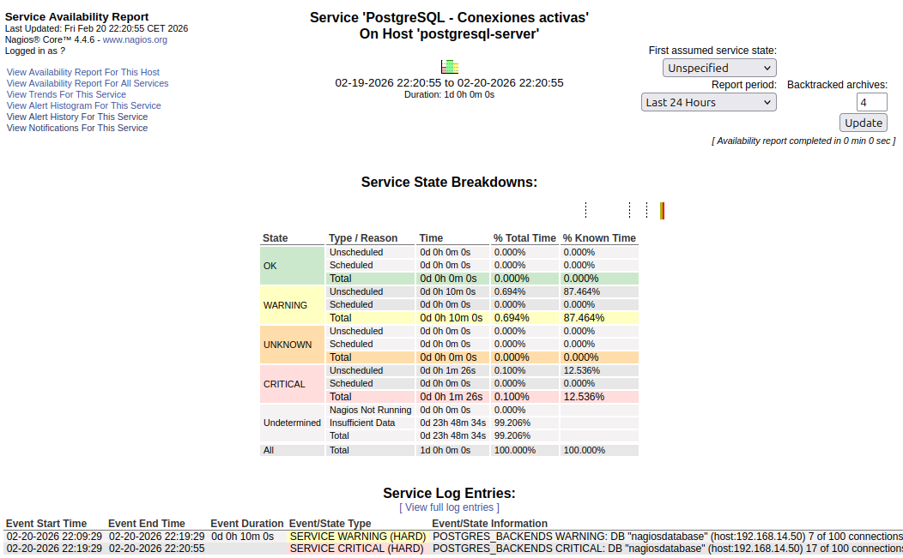

# PROYECTO DE MONITORIZACIÓN Y MANTENIMIENTO
----
## PARTE 1 - NAGIOS
----

En esta práctica vamos a trabajar con una herramienta de monitorización, Nagios. Dispondremos de una máquina que actuará como cliente con Ubuntu 24.04, en la que vamos a instalar y configurar **Nagios**, que es una herramienta muy usada para vigilar y monitorizar servidores y servicios. Es decir, es un software que se encarga de hacer comprobaciones constantemente del estado de los servidores y de forma general, mira si los servicios importantes funcionan correctamente. Por otro lado, en una máquina servidor, instalaremos **PostgreSQL**, y nos conectaremos desde la máquina cliente con **Nagios** para comprobar que la base de datos está activa y funcionando sin problemas.

----

### PREPARACIÓN DEL ESCENARIO

----

Para llevar a cabo esta práctica lo primero que debemos hacer es preparar el escenario. Vamos a trabajar un grupo de 5 personas de manera común con una máquina servidora (M.Server) y una máquina cliente (M.Client).

- M.Server → IP: 192.168.14.50
- M.Client → IP: 192.168.14.27

Como vamos a trabajar en Isard de manera común, un integrante del grupo va a hacer la creación d e de los escritorios de las MV (Server y Client). El resto de integrantes (4 restantes) crearán una MV para conectarse en remoto por SSH a las dos máquinas comunes. 

Esto será posible porque cada una de las máquinas deberá tener la interfaz de red **mvm14** activada para poder estar bajo la misma red.

El resto de las máquinas:

- M.SSH.1 → 192.168.14.29
- M.SSH.2 → 192.168.14.30
- M.SSH.3 → 192.168.14.32
- M.SSH.4 → 192.168.14.33

----

### INSTALACIÓN Y CONFIGURACIÓN DE POSTGRESQL EN M.SERVER

----

#### INSTALACIÓN

----

Ahora que ya tenemos el escenario claro y a punto, después de comprobar que todas las máquinas están en la misma red y se ven entre sí, vamos a proceder con el siguiente paso.

En la M.Server vamos a realizar en primer lugar la instalación de PostgreSQL. Como de costumbre, aunque ya lo deberíamos de tener claro, lo primero es actualizar los repositorios con **sudo apt update**.

```bash
isard@nagioserver:~$ sudo apt update
[sudo] password for isard: 
Hit:1 http://de.archive.ubuntu.com/ubuntu noble InRelease
Get:2 http://de.archive.ubuntu.com/ubuntu noble-updates InRelease [126 kB]
Get:3 http://de.archive.ubuntu.com/ubuntu noble-backports InRelease [126 kB]   
Get:4 http://security.ubuntu.com/ubuntu noble-security InRelease [126 kB]
``

Una vez actualizados, 

```bash
isard@nagioserver:~$ sudo apt install -y postgresql postgresql-client
Reading package lists... Done
Building dependency tree... Done
Reading state information... Done
The following package was automatically installed and is no longer required:
  python3-debian
```
Y comprobamos el estado.

```bash
isard@nagioserver:~$ systemctl status postgresql
● postgresql.service - PostgreSQL RDBMS
 	Loaded: loaded (/usr/lib/systemd/system/postgresql.service; enabled; prese>
 	Active: active (exited) since Tue 2026-02-17 18:24:37 UTC; 1min 16s ago
   Main PID: 2692 (code=exited, status=0/SUCCESS)
```

----

#### CONFIGURACIÓN 

----

Como por defecto PostgreSQL solo escucha conexiones locales, tendremos que habilitar las conexiones remotas, para que Nagios desde la M.Client pueda conectarse.

Recuperando lo de actividades anteriores, sabemos que para habilitar esto, debemos ir a la edición del archivo **/etc/postgresql/*/main/postgresql.conf** e ir a la línea que marca **listen_addresses =** y marcar con un * para decirle que escuche cualquier conexión externa por el puerto 5432.

> [!NOTE]
> También podríamos configurar la escucha de una única IP, poniendo la IP de la M.Client.

```bash
isard@nagioserver:~$ sudo nano /etc/postgresql/*/main/postgresql.conf
``

Por defecto la línea del archivo que hemos mencionado está comentada y solo habilitada para conexiones locales tal y como hemos dicho                                                                                             con **localhost**:

```bash
#------------------------------------------------------------------------------
# CONNECTIONS AND AUTHENTICATION
#------------------------------------------------------------------------------

# - Connection Settings -

#listen_addresses = 'localhost'     	# what IP address(es) to listen on;
                                    	# comma-separated list of addresses;
                                    	# defaults to 'localhost'; use '*' for >
                                    	# (change requires restart)
port = 5432                         	# (change requires restart)
max_connections = 100               	# (change requires restart)
```
Y así es como debe quedar tras editar la línea que hemos mencionado:

```bash
#------------------------------------------------------------------------------
# CONNECTIONS AND AUTHENTICATION
#------------------------------------------------------------------------------

# - Connection Settings -

listen_addresses = '*'      	# what IP address(es) to listen on;
                                    	# comma-separated list of addresses;
                                    	# defaults to 'localhost'; use '*' for >
                                    	# (change requires restart)
port = 5432                         	# (change requires restart)
max_connections = 100               	# (change requires restart)
```

Ahora vamos a seguir con la edición del archivo **/etc/postgresql/*/main/pg_hba.conf** en el que vamos a definir qué IP va a poder conectarse, qué usuario y a qué base de datos va a poder conectarse el cliente.

```bash
isard@nagioserver:~$ sudo nano /etc/postgresql/*/main/pg_hba.conf
```
Y nos dirigiremos a la parte de abajo del archivo para introducir esta última línea:

```bash
local   replication 	all                                 	peer
host	replication 	all         	127.0.0.1/32        	scram-sha-256
host	replication 	all         	::1/128             	scram-sha-256
host	all         	all         	192.168.14.27/32    	scram-sha-256
```

Con esto le estamos diciendo que cualquier usuario de esa única IP, va a poder conectarse a cualquier base de datos del servidor a través de la clave de acceso.

Aplicados los cambios, vamos a reiniciar PostgreSQL.

```bash
isard@nagioserver:~$ sudo systemctl restart postgresql
```

Y comprobar que tras reiniciarse, todo sigue en funcionamiento.

```bash
isard@nagioserver:~$ sudo systemctl status postgresql
● postgresql.service - PostgreSQL RDBMS
 	Loaded: loaded (/usr/lib/systemd/system/postgresql.service; enabled; prese>
 	Active: active (exited) since Tue 2026-02-17 18:49:29 UTC; 23s ago
	Process: 3747 ExecStart=/bin/true (code=exited, status=0/SUCCESS)
```
----

#### CREACIÓN DE USUARIO DE MONITORIZACIÓN Y BASE DE DATOS

----

Ahora vamos a entrar en PostgreSQL con el usuario por defecto (postgres), para crear precisamente otro usuario con el que monitorizar y no usar el que viene por defecto.

```bash
isard@nagioserver:~$ sudo -u postgres psql
psql (16.11 (Ubuntu 16.11-0ubuntu0.24.04.1))
Type "help" for help.

postgres=#
```
Creamos el usuario **nagioshacker** con la contraseña **nagioshacker**.

```bash
postgres=# CREATE ROLE nagioshacker WITH LOGIN PASSWORD 'nagioshacker';
CREATE ROLE
```
Y también creamos la base de datos **nagiosdatabase** y le ponemos como propietario el usuario que acabamos de crear **nagioshacke**.

```bash
postgres=# CREATE DATABASE nagiosdatabase OWNER nagioshacker;
CREATE DATABASE
postgres=# \q
```
Y ahora hacemos una última comprobación para asegurarnos de que el puerto **5432** está a la escucha de todo intento de conexión.

```bash
isard@nagioserver:~$ ss -lntp | grep 5432
LISTEN 0  	200      	0.0.0.0:5432  	0.0.0.0:*     	 
LISTEN 0  	200         	[::]:5432     	[::]:*
```

----
PARTE 2 - INSTALACIÓN Y CONFIGURACIÓN DE NAGIOS 
----

Vamos a instalar Nagios, el panel web funcionando, el acceso protegido con usuario, y hacer las verificaciones básicas para asegurar que todo arranca bien antes de pasar a la monitorización de PostgreSQL.

----

### Qué es Nagios y cómo funciona?

----
Nagios sirve para monitorizar, vigila máquinas y servicios haciendo comprobaciones constantes. Lo importante es entender que Nagios no “comprueba cosas” por sí solo: Nagios ejecuta plugins y con el resultado decide si algo está bien o mal, y lo pone en el panel.

----

### Por qué usamos Ubuntu Desktop como Nagios

----
Usamos Ubuntu Desktop en la M.Client por un motivo práctico: así puedemos abrir el panel web directamente desde el navegador local de la propia MV.

----

### Instalación de Nagios y Apache

----
Primero actualizamos los repositorios para instalar paquetes con información reciente:

isard@nagios:~$ sudo apt update

Después instalamos Nagios4, Apache y lo necesario para que el panel web funcione y tenga plugins básicos de la siguiente manera:

isard@nagios:~$ sudo apt install -y nagios4 apache2 php libapache2-mod-php nagios-plugins

Nagios4 es el motor, apache2 es el servidor web que muestra el panel, php y libapache2-mod-php ayudan a que la interfaz funcione, y nagios-plugins trae comprobaciones típicas tipo el ping para que Nagios ya pueda mostrar el estado.

----

### Activar CGI en Apache

----
El panel de Nagios usa CGI, es una función de Apache que permite ejecutar scripts/programas y con eso generar páginas web “dinámicas”, por eso activo el módulo CGI y reinicio Apache para aplicar los cambios:

isard@nagios:~$ sudo a2enmod cgi

isard@nagios:~$ sudo systemctl restart apache2

----

### Activar el servicio de Nagios

----
Ahora activamos Nagios y además lo dejo configurado para que arranque solo al encender la máquina y lo haremos de la siguiente manera:

isard@nagios:~$ sudo systemctl enable --now nagios4

----

### Crear usuario web de Nagios

----
Para que el panel no esté abierto a cualquier persona, creamos un usuario web con htpasswd. Este paso crea el archivo de usuarios (si no existe) y añade el usuario nagiosadmin con su contraseña:

isard@nagios:~$ sudo htpasswd -c /etc/nagios4/htpasswd.users nagiosadmin

A partir de aquí, cada vez que entre al panel web nos pedirá usuario y contraseña.

----

### Acceso al panel web

----
Cómo usamos Ubuntu Desktop, abro el firefox y accedemos a:

http://localhost/nagios4


----

### Verificación del servicio Nagios

----
Para confirmar que Nagios está realmente funcionando, revisamos el estado del servicio con:

isard@nagios:~$ systemctl status nagios4 --no-pager

Si sale activo y sin errores, sé que el servicio está corriendo correctamente, por lo tanto todo va bien

----

### Verificación de configuración interna

----
Antes de avanzar comprobamos la configuración con:

isard@nagios:~$ sudo nagios4 -v /etc/nagios4/nagios.cfg

Este comando es bastante importante ya que detecta errores de sintaxis o archivos mal cargados.


----
## PARTE 3 - SERVICIOS POR DEFECTO Y CONCEPTOS BÁSICOS DE NAGIOS
----
Nagios incluye una serie de comprobaciones básicas para el host local (la máquina donde se ejecuta Nagios). A continuación, se detallan los servicios más relevantes:

### SERVICIOS MONITORIZADOS POR DEFECTO
----

| Servicio   | Descripción                                                                 |
|------------|-----------------------------------------------------------------------------|
| LOAD       | Monitoriza la carga del sistema (CPU). Verifica si la carga promedio supera umbrales configurados (1 min, 5 min, 15 min). |
| Disk       | Comprueba el espacio disponible en particiones críticas (ej. /, /var, /home). |
| Users      | Cuenta el número de usuarios conectados al sistema (sesiones activas).     |
| PING       | Verifica la conectividad básica de red con el host (latencia y pérdida de paquetes). |
| Procesos   | Monitoriza procesos críticos (ej. nagios, apache2, httpd, sshd).            |

----
### PLUGINS ASOCIADOS
----

Cada servicio se evalúa mediante un **plugin**, que es un pequeño programa que realiza la comprobación y devuelve un código de salida estandarizado. Los plugins estándar se encuentran en:
/usr/lib/nagios/plugins/

| Servicio   | Plugin asociado     | Ubicación del plugin                          | Función principal                          |
|------------|---------------------|-----------------------------------------------|--------------------------------------------|
| LOAD       | check_load          | /usr/lib/nagios/plugins/check_load            | Mide la carga del sistema (load average)   |
| Disk       | check_disk          | /usr/lib/nagios/plugins/check_disk            | Comprueba uso de disco y espacio libre     |
| Users      | check_users         | /usr/lib/nagios/plugins/check_users           | Cuenta usuarios conectados                 |
| PING       | check_ping          | /usr/lib/nagios/plugins/check_ping            | Comprueba conectividad ICMP                |
| Procesos   | check_procs         | /usr/lib/nagios/plugins/check_procs           | Busca y cuenta procesos específicos        |

> [!NOTE]
> Los plugins se pueden ejecutar manualmente para pruebas, por ejemplo:
> ```bash
> /usr/lib/nagios/plugins/check_load -w 5.0,4.0,3.0 -c 10.0,6.0,4.0
> ```

----
### CÓDIGOS DE ESTADO
----

Los plugins devuelven uno de estos cuatro códigos de salida, que Nagios interpreta para determinar el estado del servicio:

| Código | Estado    | Descripción                                                                 | Color típico en la interfaz web |
|--------|-----------|-----------------------------------------------------------------------------|---------------------------------|
| 0      | OK        | El servicio funciona correctamente                                          | Verde                           |
| 1      | WARNING   | El servicio está cerca de un umbral crítico (ej. espacio en disco bajo)    | Amarillo                        |
| 2      | CRITICAL  | El servicio tiene un fallo grave (ej. partición llena, proceso no encontrado) | Rojo                            |
| 3      | UNKNOWN   | Error al ejecutar el plugin (ej. parámetros incorrectos, plugin no encontrado) | Gris o Naranja                  |

----
### DIFERENCIA ENTRE HOST Y SERVICE
----

- **Host**: Representa una máquina física o virtual completa (ej. `postgresql-server` con IP 192.168.14.50). Nagios verifica si el host está operativo (UP/DOWN) mediante comprobaciones como `check-host-alive` (normalmente ping).
  
- **Service**: Representa un aspecto o funcionalidad específica que se monitoriza en un host (ej. "Carga del sistema", "PostgreSQL - Conectividad", "Espacio en disco /var"). Cada service está asociado a un host y usa un plugin para su comprobación.

----
### ¿QUÉ ES UN PLUGIN?
----

Un **plugin** es un script o binario independiente que realiza una comprobación concreta y devuelve:

- Un código de estado (0, 1, 2 o 3)
- Un texto descriptivo (performance data opcional)

Nagios ejecuta estos plugins periódicamente y actúa según el resultado.

Existen dos tipos principales:

- **Estándar**: Incluidos en el paquete `nagios-plugins` o `nagios-plugins-all` (ej. `check_ping`, `check_disk`, `check_load`).
- **Personalizados**: Desarrollados para necesidades específicas (ej. `check_postgres.pl`, `check_mysql`, scripts propios).

----
### ¿CÓMO INTERPRETA NAGIOS LOS ESTADOS?
----

Nagios utiliza los códigos de estado de los plugins para:

1. Mostrar el estado actual en la interfaz web  
   (verde → OK, amarillo → WARNING, rojo → CRITICAL).

2. Enviar notificaciones cuando un servicio cambia de estado  
   (ej. de OK a CRITICAL, o de WARNING a OK).

3. Ejecutar acciones automáticas (event handlers) si están configuradas  
   (ej. reiniciar un servicio, ejecutar un script de recuperación).

----
### CAPTURAS DE PANTALLA
----

Current Status → Hosts


Current Status → Services


----
# PARTE 4 - Monitorizacion con check_pgsql (.pgpass, commands.cfg, postgresql.cfg)
----

Ahora lo siguiente será configurar el acceso sin contraseña en el archivo .pgpass
Nos iremos a:
```bash
/var/lib/nagios/.pgpass
```
Y escribiremos la IP, el puerto, seguido del nombre de la base de datos, el usuario y su respectiva contraseña:
```bash
192.168.14.50:5432:nagiosdatabase:nagioshacker:nagioshacker
```
También le asignaremos al archivo los permisos correspondientes:
```bash
isard@nagios:~$ sudo chown nagios:nagios /var/lib/nagios/.pgpass
isard@nagios:~$ sudo chmod 600 /var/lib/nagios/.pgpass
```
Lo siguiente será indicarle a Nagios, como usar el plugin check_pgsql, por lo tanto lo definiremos dentro del archivo commands.cfg
Entramos a:
```bash
/etc/nagios4/commands.cfg
```
Y pegaremos el siguiente contenido:
```bash
define command {
	command_name	check_pgsql_remote
	command_line	/usr/lib/nagios/plugins/check_pgsql -H $HOSTADDRESS$ -p 5432 -U nagioshacker -d nagiosdatabase
}
```
Lo que tenemos que hacer ahora es definir el host y el servicio, para eso, nos dirigimos al archivo postgresql.cfg

```bash
/etc/nagios4/conf.d/postgresql.cfg
```
El contenido es el siguiente:

```bash
define host {
	use	generic-host
	host_name	postgresql-server
	alias	Servidor PostgreSQL
	address	192.168.14.50
	check_command	check-host_alive
	max_check_attemtps	5
	check_period	24x7
	notification_interval	30
	noification_period	24x7
	contact_groups	admins
}

define service {
	use	generic-service
	host_name	postgresql-server
	service_description	PostgreSQL Conectividad
	check_command	check_pgsql_remote
}
```

Una vez finalizado, queda validar y reiniciar
```bash
isard@nagios:~$ sudo nagios4 -v /etc/nagios4/nagios.cfg
Nagios Core 4.4.6
Copyright (c) 2009-present Nagios Core Development Team and Community Contributors
Copyright (c) 1999-2009 Ethan Galstad
Last Modified: 2020-04-28
License: GPL

Website: https://www.nagios.org
Reading configuration data...
   Read main config file okay...
   Read object config files okay...

Running pre-flight check on configuration data...

Checking objects...
    Checked 9 services.
Warning: Host 'postgresql-server' has no default contacts or contactgroups defined!
    Checked 2 hosts.
    Checked 1 host groups.
    Checked 0 service groups.
    Checked 1 contacts.
    Checked 1 contact groups.
    Checked 179 commands.
    Checked 5 time periods.
    Checked 0 host escalations.
    Checked 0 service escalations.
Checking for circular paths...
    Checked 2 hosts
    Checked 0 service dependencies
    Checked 0 host dependencies
    Checked 5 timeperiods
Checking global event handlers...
Checking obsessive compulsive processor commands...
Checking misc settings...

Total Warnings: 1
Total Errors:   0

Things look okay - No serious problems were detected during the pre-flight check
isard@nagios:~$ 
```
Reiniciamos el servicio de nagios y ya estaría esta parte.
```bash
isard@nagios:~$ sudo systemctl restart nagios4
```

# PARTE 5 – MONITORIZACIÓN AVANZADA CON CHECK_POSTGRES

En esta parte vamos a dar un paso más allá en la monitorización del servidor PostgreSQL.
Hasta ahora hemos comprobado que el servidor está activo y que responde a conexiones. Pero el caso es que no solo nos interesa saber si el servicio está encendido, sino también cómo está funcionando internamente.

Para ello utilizaremos el plugin `check_postgres`, que nos permitirá consultar métricas internas del motor de base de datos, como por ejemplo:

Número de conexiones activas, bloqueos, el tamaño de la base de datos, replicación, estado interno del servidor, etc…

En esta práctica implementaremos la monitorización del número de conexiones activas, ya que nos permite detectar posibles saturaciones del servidor.

---

## INSTALACIÓN DEL PLUGIN CHECK_POSTGRES EN M.CLIENT

En primer lugar, trabajaremos sobre la máquina cliente donde está instalado Nagios (192.168.14.27), ya que es aquí donde se ejecutan los plugins.

Lo primero que vamos a hacer es instalar las dependencias necesarias. El plugin está escrito en Perl y necesita los módulos adecuados para poder conectarse a PostgreSQL, para ello, los instalaremos con la siguiente orden.

```bash
isard@nagios:~$ sudo apt update

isard@nagios:~$ sudo apt install -y perl libdbi-perl libdbd-pg-perl postgresql-client wget
```

Con esto, lo que hemos instalado ha sido:

Perl, que es el lenguaje en el que está escrito el plugin.
Libdbi-perl, la interfaz de conexión a bases de datos.
Libdbd-pg-perl, el driver específico para PostgreSQL.
Postgresql-client, que será la herramienta psql necesaria para pruebas.

---

## DESCARGA E INSTALACIÓN DEL PLUGIN

Seguidamente, procedemos a descargar el script oficial desde el repositorio público, para ello usaremos los siguientes comandos:

En primer lugar, entraremos directamente al directorio tmp para descargarlo desde ahi:

```bash
isard@nagios:~$ cd /tmp
```

Lo descargamos con:

```bash
isard@nagios:/tmp$ wget -O check_postgres.pl https://raw.githubusercontent.com/bucardo/check_postgres/master/check_postgres.pl
--2026-02-20 21:40:09--  https://raw.githubusercontent.com/bucardo/check_postgres/master/check_postgres.pl
S'està resolent raw.githubusercontent.com (raw.githubusercontent.com)… 185.199.109.133, 185.199.110.133, 185.199.111.133, ...
S'està connectant a raw.githubusercontent.com (raw.githubusercontent.com)|185.199.109.133|:443… conectat.
HTTP: s'ha enviat la petició, s'està esperant una resposta… 200 OK
Mida: 474274 (463K) [text/plain]
S'està desant a: ‘check_postgres.pl’

check_postgres.pl            100%[===================================================>] 463,16K  --.-KB/s   in 0,006s  

2026-02-20 21:40:10 (76,7 MB/s) - s'ha desat ‘check_postgres.pl’ [474274/474274]
```

Una vez descargado, lo movemos al directorio oficial de plugins de Nagios:

```bash
isard@nagios:/tmp$ sudo install -m 0755 check_postgres.pl /usr/lib/nagios/plugins/check_postgres.pl
```

Con esto, le hemos dado permisos de ejecución para que pueda ser ejecutado por el usuario nagios.

---

## CREACIÓN DE ACCIONES (SYMLINKS)

El plugin permite crear accesos directos para cada tipo de comprobación.

```bash
isard@nagios:/tmp$ cd /usr/lib/nagios/plugins
isard@nagios:/usr/lib/nagios/plugins$ sudo mkdir postgres
isard@nagios:/usr/lib/nagios/plugins$ cd postgres

isard@nagios:/usr/lib/nagios/plugins/postgres$  sudo perl ../check_postgres.pl --symlinks
```

Esto genera diferentes comandos internos que podremos usar para distintas métricas. como por ejemplo:

```
Created "check_postgres_archive_ready"
Created "check_postgres_autovac_freeze"
Created "check_postgres_backends"
Created "check_postgres_bloat"
Created "check_postgres_checkpoint"
Created "check_postgres_cluster_id"
Created "check_postgres_commitratio"
Created "check_postgres_connection"
Created "check_postgres_custom_query"
```

Entre otros.

---

## CONFIGURACIÓN SEGURA DE CREDENCIALES (.pgpass)

No es buena práctica dejar la contraseña en claro dentro del comando de Nagios, por eso, vamos a crear el archivo .pgpass para el usuario que ejecuta Nagios.

```bash
isard@nagios:/usr/lib/nagios/plugins/postgres$ cd ..
isard@nagios:~$ sudo -u nagios nano /var/lib/nagios/.pgpass
```

Dentro del archivo, debemos poner la siguiente línea:

```
192.168.14.50:5432:nagiosdatabase:nagioshacker:nagioshacker
```

Seguidamente, ajustamos permisos obligatorios:

```bash
isard@nagios:~$ sudo chown nagios:nagios /var/lib/nagios/.pgpass
isard@nagios:~$ sudo chmod 600 /var/lib/nagios/.pgpass
```

Si los permisos no son 600, PostgreSQL ignorará el archivo por seguridad.

---

## PRUEBA MANUAL DEL PLUGIN

Antes de integrarlo en Nagios, debemos comprobar que funciona, para ello lo verificaremos manualmente con el siguiente comando:

```bash
isard@nagios:~$ sudo -u nagios /usr/lib/nagios/plugins/check_postgres.pl \
--action=backends --host=192.168.14.50 \
--db=nagiosdatabase --dbuser=nagioshacker
```

Si todo está correcto como ha sido en este caso, debería habernos salido algo parecido a lo siguiente:

```
POSTGRES_BACKENDS OK: DB "nagiosdatabase" (host:192.168.14.50) 1 of 100 connections (1%) | time=0.17s nagiosdatabase=1;90;95;0;100 postgres=0;90;95;0;100 template0=0;90;95;0;100 template1=0;90;95;0;100
```

Con esto, hemos podido comprobar y verificar la conectividad, las credenciales y su funcionamiento interno.

---

## CREACIÓN DEL COMANDO EN NAGIOS

Ahora vamos a definir el comando que usará Nagios.

Editamos el archivo de comandos:

```bash
isard@nagios:~$ sudo nano /etc/nagios4/commands.cfg
```

Añadimos al final:

```
define command{
command_name dhayan_check_postgres_backends
command_line /usr/lib/nagios/plugins/check_postgres.pl --action=backends --host=$HOSTADDRESS$ --db=nagiosdatabase --dbuser=nagioshacker --warning=5 --critical=10
}
```

Aquí estamos definiendo que nos indique un warning si hay más de 5 conexiones y un critical si supera las 10.

---

## DEFINICIÓN DEL SERVICIO EN NAGIOS

Crearemos nuestro propio archivo para no interferir con el trabajo del grupo ya que estamos trabajando de manera simultánea.

```bash
isard@nagios:~$ sudo nano /etc/nagios4/conf.d/dhayan-postgres-advanced.cfg
```

Añadimos:

```
define service{
    use                     generic-service
    host_name               postgresql-server
    service_description     PostgreSQL - Conexiones activas
    check_command           dhayan_check_postgres_backends
}
```

Con esto estamos asociando el servicio al host ya definido previamente.

---

## VALIDACIÓN DE LA CONFIGURACIÓN

Antes de reiniciar Nagios debemos validar que la configuración es correcta.

```bash
isard@nagios:~$ sudo nagios4 -v /etc/nagios4/nagios.cfg
```

```
Nagios Core 4.4.6
Copyright (c) 2009-present Nagios Core Development Team and Community Contributors
Copyright (c) 1999-2009 Ethan Galstad
Last Modified: 2020-04-28
License: GPL

Website: https://www.nagios.org
Reading configuration data...
   Read main config file okay...
   Read object config files okay...

Running pre-flight check on configuration data...

Checking objects...
    Checked 10 services.
Warning: Host 'postgresql-server' has no default contacts or contactgroups defined!
    Checked 2 hosts.
    Checked 1 host groups.
    Checked 0 service groups.
    Checked 1 contacts.
    Checked 1 contact groups.
    Checked 180 commands.
    Checked 5 time periods.
    Checked 0 host escalations.
    Checked 0 service escalations.
Checking for circular paths...
    Checked 2 hosts
    Checked 0 service dependencies
    Checked 0 host dependencies
    Checked 5 timeperiods
Checking global event handlers...
Checking obsessive compulsive processor commands...
Checking misc settings...

Total Warnings: 1
Total Errors:   0

Things look okay - No serious problems were detected during the pre-flight check
```

El warning que nos devuelve solo indica que el host postgresql-server no tiene contactos/grupos de contacto por defecto, así que Nagios no sabría a quién avisar si ese host cae pero la monitorización y el estado en el panel seguirán funcionando, por lo cual, podemos proceder a reiniciar:

```bash
isard@nagios:~$ sudo systemctl restart nagios4
```

---

## DEMOSTRACIÓN PRÁCTICA

Para comprobar que funciona correctamente, abrimos varias conexiones simultáneas al servidor PostgreSQL, para ello, abriremos varias terminales y dejaremos las sesiones abiertas usando el siguiente comando en todas ellas:

```bash
isard@nagios:~$ psql "host=192.168.14.50 dbname=nagiosdatabase user=nagioshacker"
```

Desde el panel web, podremos observar el cambio de estado en tiempo real, para ello entraremos en la siguiente url, que es donde observaremos los cambios:

```
http://localhost/nagios4
```

Al superar la cantidad de conexiones que habíamos establecido, nos saldrá lo siguiente:

Al haberme conectado simultáneamente en 6 terminales, el estado pasará a WARNING:

<figure>
  
</figure>
<figure>
  
</figure>
<figure>
  
</figure>

Si superamos las 10 conexiones, pasará a CRITICAL:

<figure>
  
</figure>
<figure>
  
</figure>

---

## CONCLUSIÓN

Con esta configuración hemos podido implementar una monitorización avanzada del servidor PostgreSQL.

Ya no sólo comprobamos si el servicio está activo, sino también si está saturado, si el número de conexiones es exagerado e incluso si existe riesgo de bloqueo por exceso de sesiones.

Este tipo de monitorización es preventiva y permite que nos anticipemos a un posible fallo antes de que el servicio deje de estar disponible.
