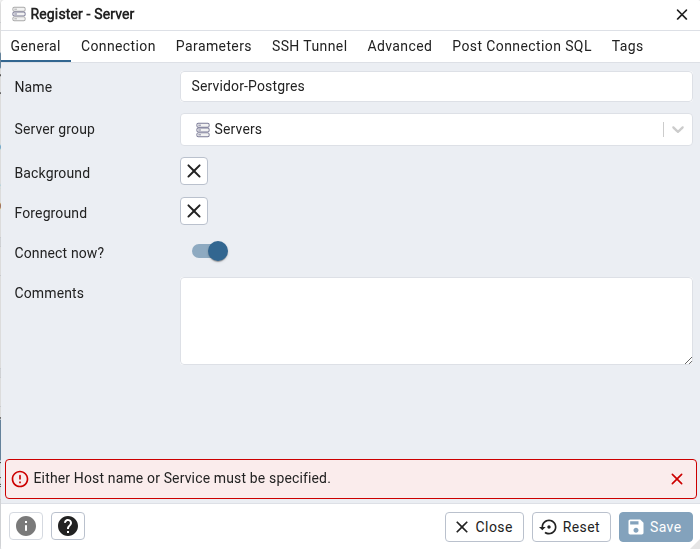
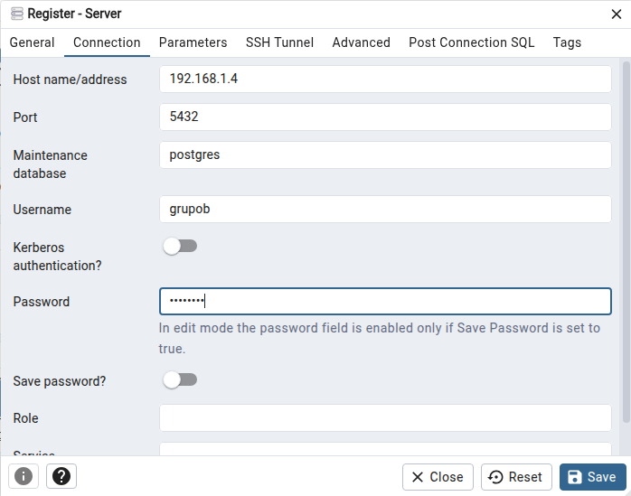
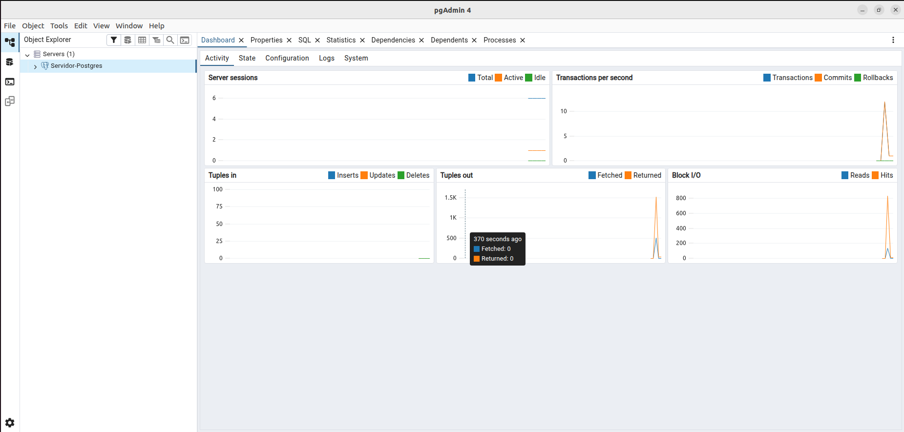
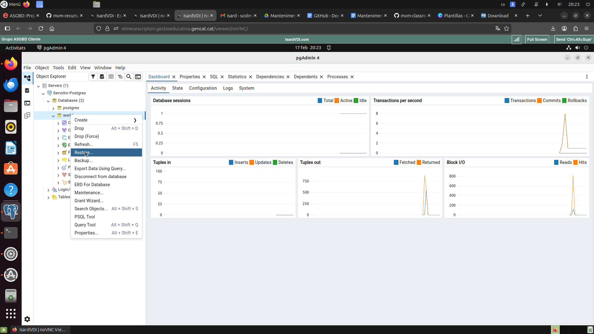
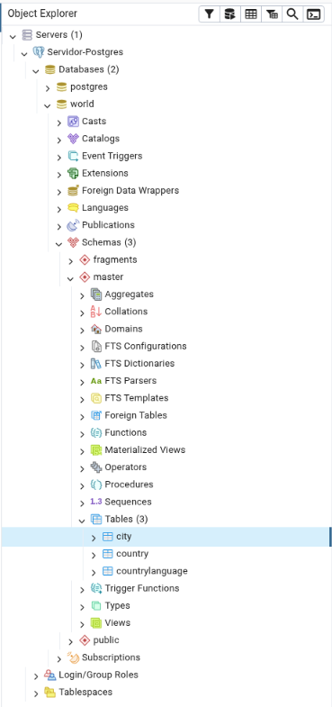

# Mantenimiento de un SGBD

### Miembros
>[!NOTE]
> - Santino Colmena 
> - Carlos Cano
> - David Simon
> - Abdullah Hussain
> - Lucas Alberola
> - Emmanuel Collins

## [Presentación - Canva](https://www.canva.com/design/DAHCDHAgwZs/-RD6GI33ppOjdqCj5XrFwQ/edit?utm_content=DAHCDHAgwZs&utm_campaign=designshare&utm_medium=link2&utm_source=sharebutton "Ir al sitio oficial")

---

#  1. Objetivo de la práctica

El objetivo de esta práctica es aplicar técnicas reales de mantenimiento en un Sistema Gestor de Bases de Datos (SGBD) utilizando PostgreSQL.

Se trabajará sobre:

- Análisis de rendimiento con `EXPLAIN ANALYZE`
- Optimización mediante índices
- Reorganización física con `CLUSTER`
- Gestión del espacio en disco con `DELETE`
- Mantenimiento con `VACUUM` y `VACUUM FULL`

Se utilizará una base de datos restaurada desde el backup `dades.backup`.


# 2. Arquitectura del entorno

### Máquina Servidor
- Ubuntu Server
- PostgreSQL 17/18

### Máquina Cliente
- Ubuntu Desktop
- pgAdmin 4

# 3. Instalación del servidor PostgreSQL

Actualización del sistema:

```bash
sudo apt update
sudo apt upgrade -y
```

Instalación de PostgreSQL:

```bash
sudo apt install postgresql postgresql-contrib -y
```

Verificación del servicio:

```bash
sudo systemctl status postgresql
```

Debe aparecer:

```
active (running)
```

Acceso al gestor:

```bash
sudo -u postgres psql
```

Creación de la base de datos:

```sql
CREATE DATABASE world;
```


# 4. Crear usuario para conexiones remotas

No vamos a usar siempre la cuenta de administrador, así que creamos un usuario específico para el grupo:

```sql
CREATE USER grupob WITH PASSWORD 'pirineus';
GRANT ALL PRIVILEGES ON DATABASE world TO grupob;
```


# 5. Configuración para conexiones remotas

Para que el cliente se comunique con el servidor, hay que abrir las conexiones:

En `postgresql.conf`, cambiar:

```
listen_addresses = '*'
```

En `pg_hba.conf`, añadir al final:

```
host all all 0.0.0.0/0 md5
```

Reiniciar servicio:

```bash
sudo systemctl restart postgresql
```


# 6. Instalación del cliente (pgAdmin)

```bash
sudo snap install pgadmin4
```

Nos conectamos usando los siguientes parámetros:

- Nombre: Servidor-Postgres
- IP del servidor: 192.168.1.4  
- Usuario: grupob  
- Contraseña: pirineus
- Puerto:  5432
  




Vemos como hemos entrado en el usuario grupob desde el pgAdmin




# 7. Restauración del backup

En pgAdmin:

Click derecho sobre `world` → **Restore**

Seleccionar archivo:

```
dades.backup
```




Tras la restauración podemos ver gráficamente como se ha restaurado la base de datos



También podemos comprobar que se han restaurado haciendo un

```sql
SELECT COUNT(*) FROM master.city;
```

Resultado esperado:

```
4079 filas
```

# 8. Problema de permisos

```sql
GRANT ALL PRIVILEGES ON SCHEMA master TO grupob;
GRANT ALL PRIVILEGES ON ALL TABLES IN SCHEMA master TO grupob;
GRANT ALL PRIVILEGES ON ALL SEQUENCES IN SCHEMA master TO grupob;
```


# 9. Análisis con EXPLAIN ANALYZE (ANTES del índice)

```sql
EXPLAIN ANALYZE
SELECT *
FROM master.city ci
INNER JOIN master.country co
ON ci.countrycode = co.code
WHERE ci.population BETWEEN 1000 AND 5000
ORDER BY ci.id;
```

### Resultado

- Plan: **Seq Scan**
- Tiempo aproximado: **~1.66 ms**

Esto indica que PostgreSQL recorría toda la tabla aplicando el filtro después.


# 10. Creación de índice

```sql
CREATE INDEX idx_city_population
ON master.city (population);

ANALYZE master.city;
```


Volvemos a ejecutar el EXPLAIN ANALYZE.

### Nuevo plan:

- Bitmap Index Scan
- Bitmap Heap Scan

### Nuevo tiempo:

**~0.28 ms**


Mejora clara de rendimiento.

#  11. CLUSTER (Optimización física)

Crear índice por id:

```sql
CREATE INDEX idx_city_id_cluster
ON master.city (id);
```

Aplicar CLUSTER:

```sql
CLUSTER master.city USING idx_city_id_cluster;
ANALYZE master.city;
```


###  ¿Qué hace CLUSTER?

- Reordena físicamente la tabla según el índice.
- Mejora la localidad de datos en disco.
- No es permanente (no se mantiene automáticamente).

En nuestro caso, al ser una tabla pequeña, no hubo un cambio significativo en el plan.


# 12. DELETE masivo

Tamaño antes del DELETE:

```sql
SELECT
pg_size_pretty(pg_relation_size('master.city')) AS table_size,
pg_size_pretty(pg_total_relation_size('master.city')) AS total_size;
```


Resultado:

```
table_size = 256 kB
total_size = 408 kB
```

Ejecutamos:

```sql
DELETE FROM master.city
WHERE id NOT IN (
SELECT capital
FROM master.country
WHERE capital IS NOT NULL
);
```


Resultado:

```
DELETE 3847
```

Filas restantes:

```sql
SELECT COUNT(*) FROM master.city;
```

Resultado:

```
232 filas
```


# 13. ¿Por qué no baja el tamaño?

Tras el DELETE:

El tamaño físico NO disminuye.

Esto ocurre porque PostgreSQL utiliza **MVCC**:

- Las filas eliminadas se convierten en "dead tuples".
- El espacio queda marcado como reutilizable.
- Pero el archivo físico no se reduce automáticamente.


# 14. VACUUM

```sql
VACUUM (VERBOSE, ANALYZE) master.city;
```

Mensaje:

```
232 tuples remain
0 are dead but not yet removable
```

El espacio queda reutilizable internamente  
 El tamaño físico no disminuye


# 15. VACUUM FULL

Para liberar espacio real se ejecutó:

```sql
VACUUM FULL master.city;

```
Este comando reescribe la tabla completa en disco, eliminando el espacio vacío y compactando el fichero.

Tras ejecutarlo, el tamaño sí se redujo.

#  16. Conclusiones
En esta práctica se ha comprobado que:

- `EXPLAIN ANALYZE` permite detectar cuellos de botella.
- Los índices mejoran significativamente el rendimiento.
- `CLUSTER` optimiza físicamente la tabla.
- `DELETE` no libera espacio automáticamente.
- `VACUUM` mantiene la base saludable.
- `VACUUM FULL` libera espacio físico real.

Hemos aplicado mantenimiento:

- Lógico (índices, análisis)
- Físico (cluster, vacuum)
- De almacenamiento (gestión de espacio)
  
La práctica demuestra la importancia del mantenimiento periódico en bases de datos reales y cómo una correcta estrategia de optimización mejora tanto el rendimiento como la gestión del almacenamiento.
