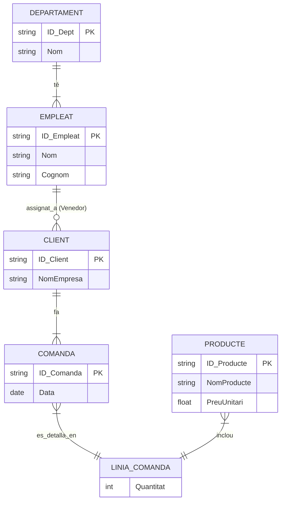
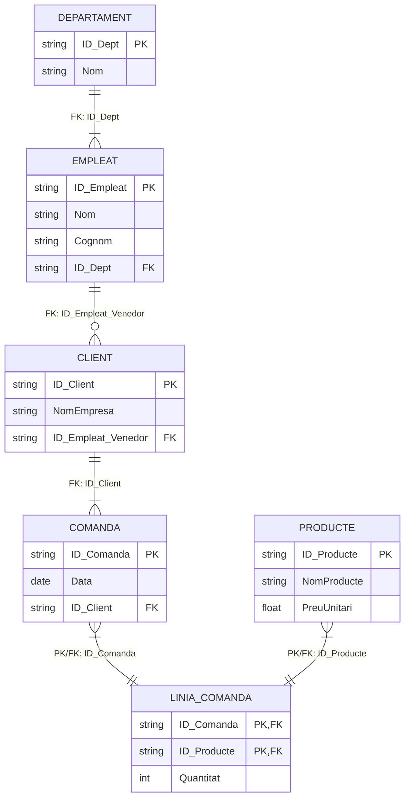

# Cas pràctic 1: Dunder Mifflin - L'empresa de paper

## 0. Enunciat

> [!NOTE]
> Tenim una empresa, anomenada Dunder Mifflin, que es dedica a la comercialització de tot tipus de paper.  
> 
> Tenim empleats, que poden treballar a diferents departaments (magatzem, transport, oficina...)
> 
> Tenim clients, que fan comandes de diferents productes de papereria. Cada comanda ha de tenir com a mínim un producte, pero podem tenir més d'un producte per comanda i podem demanar varies unitats del mateix producte
> 
> Tenim venedors (que son empleats) asignats a clients (un venedor pot tenir molts clients, pero a un client no el pot portar més dún venedor)
> 

## 1. Model conceptual: Diagrama ER o ERM
El model ERM és el disseny conceptual. Ens centrem a identificar les "coses" (entitats) i com es connecten (relacions).

### Procés d'elaboració:

1. **Identificar Entitats:** Són els substantius principals de l'enunciat.
    
    - `EMPLEAT`
        
    - `DEPARTAMENT`
        
    - `CLIENT`
        
    - `COMANDA`
        
    - `PRODUCTE`
        
2. **Identificar Relacions i Cardinalitat:** Mirem com interactuen les entitats.
    
    - "Empleats... treballen a diferents departaments": Un departament té molts empleats, però un empleat només pertany a un departament.
        
        - Relació: `Treballa_En` (1:N) entre `DEPARTAMENT` (1) i `EMPLEAT` (N).
            
    - "Venedors (que són empleats) assignats a clients": Un venedor (empleat) pot tenir molts clients. Un client només té un venedor.
        
        - Relació: `Assignat_A` (1:N) entre `EMPLEAT` (1) i `CLIENT` (N).
            
    - "Clients... fan comandes": Un client pot fer moltes comandes. Una comanda pertany a un sol client.
        
        - Relació: `Fa` (1:N) entre `CLIENT` (1) i `COMANDA` (N).
            
    - "Cada comanda ha de tenir... més d'un producte": Una comanda pot tenir molts productes, i un producte pot estar a moltes comandes.
        
        - Relació: `Conté` (N:M) entre `COMANDA` (N) i `PRODUCTE` (M).
            
3. **Gestionar Relacions N:M (Molts a Molts):**
    
    - La relació N:M (`Conté`) és problemàtica. L'enunciat diu que "podem demanar varies unitats del mateix producte". Aquesta "quantitat" no pertany ni a la `COMANDA` (perquè la comanda té molts productes) ni al `PRODUCTE` (perquè el producte està en moltes comandes).
        
    - Aquest atribut (`Quantitat`) pertany a la _relació_ entre elles.
        
    - Per solucionar-ho, convertim la relació `Conté` en una **entitat associativa** (o feble), que anomenarem `LINIA_COMANDA`. Aquesta nova entitat emmagatzema la `Quantitat`.

### Diagrama


## 2. Model Relacional (RM)

Ara "traduïm" el plànol conceptual (ERM) a un esquema lògic (RM) que una base de dades pugui implementar. Aquest model es basa en **taules**, **columnes** i **claus foranes (FK)**.

### Procés de transformació (com passar ERM a RM):

1. **Entitats → Taules:** Totes les entitats fortes (`DEPARTAMENT`, `EMPLEAT`, `CLIENT`, `COMANDA`, `PRODUCTE`) i l'entitat associativa (`LINIA_COMANDA`) es converteixen en taules.
    
2. **Atributs → Columnes:** Els atributs de cada entitat es converteixen en les columnes de la seva taula.
    
3. **Relacions 1:N → Claus Foranes (FK):** La clau primària (PK) de l'entitat "1" _viatja_ a la taula "N" per actuar com a clau forana (FK).
    
    - `DEPARTAMENT (1) -- (N) EMPLEAT`: La PK `ID_Dept` de `DEPARTAMENT` s'afegeix a la taula `EMPLEAT` com a `ID_Dept (FK)`.
        
    - `EMPLEAT (1) -- (N) CLIENT`: La PK `ID_Empleat` d'`EMPLEAT` s'afegeix a la taula `CLIENT` com a `ID_Empleat_Venedor (FK)`.
        
    - `CLIENT (1) -- (N) COMANDA`: La PK `ID_Client` de `CLIENT` s'afegeix a la taula `COMANDA` com a `ID_Client (FK)`.
        
4. **Relacions N:M (Taula Associativa) → Claus Foranes:** La taula `LINIA_COMANDA` rep les claus primàries de les dues taules que connecta (`COMANDA` i `PRODUCTE`).
    
    - `ID_Comanda (FK)` i `ID_Producte (FK)`.
        
    - **Important:** La clau primària (PK) de la taula `LINIA_COMANDA` és la combinació de les dues claus foranes (`ID_Comanda`, `ID_Producte`). Això assegura que no podem afegir el mateix producte dues vegades a la mateixa comanda (tot i que sí podem actualitzar-ne la quantitat).

### Diagrama


## 3. Normalització (`1NF`, `2NF`, `3NF`)

La normalització és un procés sistemàtic que s'aplica al Model Relacional (RM) per organitzar les dades de manera eficient.

**Els objectius principals són:**

- **Reduir la redundància:** No emmagatzemar la mateixa informació múltiples vegades.
    
- **Millorar la integritat de les dades:** Assegurar que les dades siguin coherents i correctes.
    

Per aconseguir-ho, la normalització busca eliminar les **anomalies**, que són problemes que sorgeixen en gestionar dades redundants:

> [!CAUTION]
> - **Anomalia d'Actualització:** Si hem d'actualitzar una dada (p. ex., el nom d'un client), i aquesta dada està repetida en 100 files diferents, hem de fer 100 actualitzacions. Si una falla, tindrem dades inconsistents.


> [!CAUTION]
> - **Anomalia d'Inserció:** No podem afegir una dada nova si no tenim la resta d'informació. (p. ex., no podem afegir un nou `PRODUCTE` al sistema fins que algú no faci una `COMANDA` d'aquest).


> [!CAUTION]
> - **Anomalia d'Esborrat:** En esborrar una fila, podem perdre informació que no volíem esborrar. (p. ex., si esborrem l'única comanda d'un client, podem perdre les dades del client per sempre).
  

La normalització es basa en aplicar unes regles progressives anomenades **Formes Normals**. Les més comunes són la `1NF`, `2NF` i `3NF`.

---

### Primera Forma Normal (1NF): Atomicitat

La 1NF és la base de qualsevol base de dades relacional.

- **Regla:** Totes les columnes han de contenir **valors atòmics** (indivisibles). No es permeten llistes, "columnes repetitives" (com `Producte1`, `Producte2`...) ni valors multivaluats en una sola cel·la.
    

#### Mal Disseny (No 1NF):

Imaginem una taula `COMANDA` on intentem desar els productes i les quantitats en la mateixa fila:

|ID_Comanda (PK)|Data|ID_Client|Productes|Quantitats|
|---|---|---|---|---|
|1001|2024-10-21|C-01|"P-01, P-02"|"5, 10"|
|1002|2024-10-22|C-02|"P-01"|"2"|

> [!CAUTION]
> **Anomalies:**
> 
> 1. **Consulta:** Com podem saber quantes unitats de "P-01" s'han venut en total? És molt difícil.
>     
> 2. **Actualització:** Com actualitzem la quantitat de "P-01" a 7 a la comanda 1001, sense afectar "P-02"? Hem de llegir la llista, modificar-la i tornar-la a desar.
>     

#### Solució (El nostre model RM):

Vam crear una taula associativa (`LINIA_COMANDA`) que descompon la llista en files individuals. Cada cel·la és ara atòmica.

**Taula `COMANDA` (1NF):** 

| ID_Comanda (PK) | Data       | ID_Client (FK) |
| --------------- | ---------- | -------------- | 
| 1001            | 2024-10-21 | C-01           | 
| 1002            | 2024-10-22 | C-02           | 

**Taula `LINIA_COMANDA` (1NF):** 

| ID_Comanda (PK, FK) | ID_Producte (PK, FK) | Quantitat | 
| :------------------ | :------------------- | :-------- | 
| 1001                | P-01                 | 5         | 
| 1001                | P-02                 | 10        | 
| 1002                | P-01                 | 2         | 

### Segona Forma Normal (2NF): Dependència Funcional Completa

- **Requisit:** La taula ja ha d'estar en 1NF.
    
- **Regla:** Aquesta regla s'aplica només a taules amb **Claus Primàries Compostes** (claus formades per més d'una columna). La regla diu: _Tots els atributs no-clau han de dependre funcionalment de la clau primària **completa**, i no només d'una part d'ella._
    

#### Mal Disseny (No 2NF):
Agafem la nostra taula `LINIA_COMANDA` (que té una PK composta: `ID_Comanda` + `ID_Producte`) i afegim-hi dades del producte:

**Taula `LINIA_COMANDA_MALAMENT`:** 

| ID_Comanda (PK, FK) | ID_Producte (PK, FK) | Quantitat | NomProducte | PreuUnitari |
| :------------------ | :------------------- | :-------- | :---------- | :---------- |
| 1001                | P-01                 | 5         | Resma A4    | 4.50        |
| 1001                | P-02                 | 10        | Clips       | 1.20        |
| 1002                | P-01                 | 2         | Resma A4    | 4.50        |

**El problema (Dependència Parcial):**

- `Quantitat`: Depèn de `ID_Comanda` + `ID_Producte` (Correcte ✅).
    
- `NomProducte`: Depèn **només** de `ID_Producte` (Incorrecte ❌).
    
- `PreuUnitari`: Depèn **només** de `ID_Producte` (Incorrecte ❌).
    

> [!CAUTION]
> **Anomalies:**
> 
> 1. **Actualització:** Si el preu de "Resma A4" (P-01) canvia de 4.50 a 4.75, hem d'actualitzar-lo a la fila 1 _i_ a la fila 3 (i a totes les altres comandes on aparegui). Això és una redundància massiva.
>     
> 2. **Inserció:** No podem afegir un producte nou ("P-03", "Grapes") al nostre catàleg fins que algú no el demani (perquè necessitem un `ID_Comanda` per omplir la clau primària).
>     

#### Solució (El nostre model RM):

Vam moure les dades que depenien només de `ID_Producte` a la seva pròpia taula: `PRODUCTE`.

**Taula `PRODUCTE` (2NF):** 

| ID_Producte (PK) | NomProducte | PreuUnitari |
| :--------------- | :---------- | :---------- |
| P-01             | Resma A4    | 4.50        |
| P-02             | Clips       | 1.20        |

**Taula `LINIA_COMANDA` (2NF):** 

| ID_Comanda (PK, FK) | ID_Producte (PK, FK) | Quantitat | 
| :------------------ | :------------------- | :-------- | 
| 1001                | P-01                 | 5         |
| 1001                | P-02                 | 10        |
| 1002                | P-01                 | 2         |

Ara, si el preu de "Resma A4" canvia, només ho actualitzem un cop a la taula `PRODUCTE`.

### Tercera Forma Normal (3NF): Sense Dependències Transitives

- **Requisit:** La taula ja ha d'estar en 2NF.
    
- **Regla:** _Cap atribut no-clau pot dependre d'un altre atribut no-clau_. Això s'anomena **dependència transitiva**.
    

#### Mal Disseny (No 3NF):

Mirem la taula `EMPLEAT` i afegim-hi les dades del seu departament:

**Taula `EMPLEAT_MALAMENT`:** 

| ID_Empleat (PK) | Nom | Cognom | ID_Dept (FK) | Nom_Dept | Ubicacio_Dept | 
| :--- | :--- | :--- | :--- | :--- | :--- | 
| E-01 | Michael | Scott | D-01 | Vendes | Oficina Principal | 
| E-02 | Dwight | Schrute | D-01 | Vendes | Oficina Principal | 
| E-03 | Darryl | Philbin | D-02 | Magatzem | Soterrani |

**El problema (Dependència Transitiva):**

- `Nom_Dept` i `Ubicacio_Dept` no depenen directament de la PK (`ID_Empleat`).
    
- Depenen d'un altre atribut no-clau (`ID_Dept`).
    
- La dependència és: `ID_Empleat` → `ID_Dept` → `Nom_Dept` (Això és transitiu ❌).
    

> [!CAUTION]
> **Anomalies:**
> 
> 1. **Actualització:** Si el departament de "Vendes" (D-01) es trasllada a "Planta 2", hem de canviar la columna `Ubicacio_Dept` a la fila de Michael _i_ a la de Dwight (i a la de tots els venedors).
>     
> 2. **Esborrat:** Si acomiadem Darryl (E-03) i era l'únic empleat de "Magatzem", en esborrar la seva fila perdem per sempre la informació que el departament "Magatzem" (D-02) existeix i que és al "Soterrani".
>     

#### Solució (El nostre model RM):

Vam moure les dades que depenien de `ID_Dept` a la seva pròpia taula: `DEPARTAMENT`.

**Taula `DEPARTAMENT` (3NF):** 

| ID_Dept (PK) | Nom_Dept | Ubicacio_Dept | 
| :--- | :--- | :--- | 
| D-01 | Vendes | Oficina Principal | 
| D-02 | Magatzem | Soterrani |

**Taula `EMPLEAT` (3NF):** 

| ID_Empleat (PK) | Nom     | Cognom  | ID_Dept (FK) |
| :-------------- | :------ | :------ | :----------- |
| E-01            | Michael | Scott   | D-01         |
| E-02            | Dwight  | Schrute | D-01         |
| E-03            | Darryl  | Philbin | D-02         |

Ara, si el departament de "Vendes" es mou, només ho canviem un cop a la taula `DEPARTAMENT`. Si acomiadem Darryl, la taula `DEPARTAMENT` roman intacta.

> [!TIP]
> El nostre Model Relacional (RM) final compleix la 3NF, assegurant que les dades són eficients, fiables i fàcils de mantenir.

---

## 4. Model Relacional en DBML: Una mica més aprop de tenir la nostra base de dades

`DBML` (*Database Markup Language*) és un llenguatge declaratiu senzill per definir esquemes de bases de dades. El nostre model relacional de Dunder Mifflin es traduiria de la següent manera:

```d
// Model de Dades de Dunder Mifflin
// Aquest model està normalitzat (3NF) per gestionar empleats, clients i comandes.

Project DunderMifflin {
  database_type: 'PostgreSQL'
  Note: 'Esquema relacional per Dunder Mifflin Paper Company'
}

Table DEPARTAMENT {
  Id int [pk, increment, note: 'Identificador únic (auto-incremental)']
  Nom varchar [not null]
}

Table EMPLEAT {
  Id int [pk, increment, note: 'Identificador únic de l\'empleat']
  Nom varchar [not null]
  Cognom varchar
  Id_Departament int [not null, note: 'Enllaç al departament on treballa']
  
  Note: 'Inclou tots els empleats, inclosos els venedors.'
}

Table CLIENT {
  Id int [pk, increment, note: 'Identificador únic del client']
  NomEmpresa varchar [not null]
  Id_Venedor int [not null, note: 'FK a l\'Empleat (Venedor) assignat']
}

Table COMANDA {
  Id int [pk, increment, note: 'Número de comanda únic']
  Data timestamp [not null, default: `now()`]
  Id_Client int [not null, note: 'FK al Client que fa la comanda']
}

Table PRODUCTE {
  Id int [pk, increment, note: 'Identificador intern de producte']
  NomProducte varchar [not null]
  PreuUnitari decimal(10, 2) [not null, note: 'Preu per unitat']
}

Table LINIA_COMANDA {
  // Taula associativa (N:M)
  Id_Comanda int [pk, note: 'FK a Comanda']
  Id_Producte int [pk, note: 'FK a Producte']
  Quantitat int [not null, default: 1]

  indexes {
    (Id_Comanda, Id_Producte) [pk] // Clau Primària Composta
  }
  
  Note: 'Detall de productes i quantitats per a cada comanda'
}

// --- RELACIONS (Claus Foranes) ---

// Un Departament té molts Empleats (1:N)
Ref: EMPLEAT.Id_Departament > DEPARTAMENT.Id

// Un Empleat (Venedor) té molts Clients (1:N)
Ref: CLIENT.Id_Venedor > EMPLEAT.Id

// Un Client fa moltes Comandes (1:N)
Ref: COMANDA.Id_Client > CLIENT.Id

// Una Comanda té moltes Línies de Comanda (1:N)
Ref: LINIA_COMANDA.Id_Comanda > COMANDA.Id

// Un Producte està a moltes Línies de Comanda (1:N)
Ref: LINIA_COMANDA.Id_Producte > PRODUCTE.Id
```
Podem fer servir eines com [dbdiagram.io](https://dbdiagram.io)

També podem fer servir, per exemple, extensions de VSCode com [DBML Entity-Relationship Diagrams visualizer](https://marketplace.visualstudio.com/items?itemName=bocovo.dbml-erd-visualizer)

---
