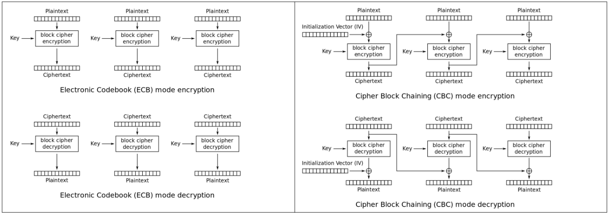

# Criptografia moderna

# Què és la criptografia (moderna) 

S'anomena **criptologia** a la ciència que estudia l'escriptura secreta, és a dir, els missatges que, processats de certa manera, es converteixen en difícils o impossibles de llegir per entitats no autoritzades. Es compon de dues disciplines: 

 - La **criptografia**: que s'ocupa de l'estudi dels algorismes, protocols i sistemes que s'utilitzen per protegir la informació i dotar de seguretat les comunicacions i les entitats que es comuniquen
  
 - El **criptoanàlisi**: que s'ocupa d'aconseguir capturar *criptogrames* –és a dir, els missatges xifrats- construïts mitjançant criptografia sense tenir-ne autorització i intentar llavors obtenir-ne el text en clar corresponent -el que se'n diu, "trencar el criptograma"- mitjançant l'ús de tècnices especialitzades
   
Es considera *moderna* a la criptografia apareguda a partir de la **IIª Guerra Mundial**, ja que va ser el moment en el què es van començar a utilitzar màquines especialitzades (més endavant, ordinadors) per generar *criptogrames* i/o per trencar-los d'una forma automàtica. 

L'ús d'aquestes màquines va obligar a canviar completament tots els mètodes emprats des de l'antiguitat fins llavors en relació a la creació de *criptogrames*, ja què aquests van quedar de cop obsolets en tornar-se vulnerables. 

# Problemes que resol la criptografia moderna 

Per a què una comunicació es pugui considerar segura, el mètode criptogràfic utilitzat haurà de garantir que aquesta comunicació tingui les següents característiques:

- **Confidencialitat**: En xifrar un missatge `A` s'obté com a resultat un missatge `B` diferent de l'original que tindrà un significat només conegut per qui pugui desxifrar-lo (tornant a obtenir així el missatge original `A` de nou). El missatge `B` pot ser emmagatzemat o bé transmès a un determinat destí, tant se val: la idea és que un receptor, hagi obtingut com hagi obtingut el missatge `B`, no pugui desxifrar-lo (és a dir, entendre'l) si no és el receptor legítim
   
- **Autenticitat**: L'objectiu és assegurar que el remitent del missatge sigui qui realment diu que és 
  
- **Integritat**: L'objectiu és detectar una eventual alteració del missatge original 
  
- **No repudi**: L'objectiu és evitar que un remitent pugui negar ser l'autor d'un missatge enviat per ell prèviament (només alguns algoritmes de tipus asimètric ofereixen aquesta característica, però) 
  

# Tipus d'algoritmes criptogràfics 

## Simètrics 
Es fa servir la mateixa clau (binària) pels tant en l'algoritme de xifrat com en el de desxifrat ; per això a vegades aquesta clau també s'anomena "compartida" (entre l'emissor i el receptor del missatge). Aquest tipus de criptografia és ràpida i segura però el seu major problema és com distribuir aquesta clau compartida entre els extrems a través d'un canal insegur abans que la comunicació segura pugui començar; per resoldre això será necessari l'ús de protocols asimètrics (ja els veurem [més endavant](#asimètrics)).

## Confidencialitat en criptografia simètrica 
Per xifrar/desxifrar hi ha disponibles diversos algoritmes simètrics a escollir, cadascun dels quals es pot classificar genèricament en una de les dues grans categories següents: 
### De flux (stream) 
Xifren bit a bit. Són útils en fluxos de dades en temps real amb poca estructura. 

Exemples d'algoritmes: 

- `XOR`

- `RC4` 

- `ChaCha20/12/8`

- `Salsa20/12/8`

### De bloc 
En comptes de xifrar un bit cada cop, xifren un bloc de bits a la vegada (la mida dels quals pot ser 64 bits, 128 bits...depèn de l'algoritme triat). 

Exemples d'algoritmes: 

- `AES` (amb diversos modes d'operació -veure [exemple](#exemple-comparació-entre-el-funcionament-dels-modes-ecb-i-cbc)- i diversos tamanys de claus estàndard: `128 bits`, `256 bits`,... -en general, quant més llarga més segura però també més costosa computacionalment-) 

- `Blowfish` 

- `Twofish` 

- `Serpent` 

- `CAST` 

- `LOKI` 

- `DES` 

- `3DES`

En tot cas, qualsevol algoritme de xifrat ha de generar un resultat el més aparentment aleatori possible (és a dir, semblant a soroll) per a què no es pugui deduir, per començar, ni tan sols quin algoritme s'ha utilitzat. És a dir, el **criptoanalista** no només hauria de coneixer la **clau** sinó també, primer, l'**algoritme** emprat (i també, si s'escaiés, la funció **KDF** emprada). 

### Modes d'operació en un algoritme simètric de bloc 
Què passa, però, si s'ha de xifrar més d'un bloc? Que s'ha d'escollir un **mode d'operació**, el qual determina com connectar els blocs. Depenent del mode d'operació escollit, la seguretat del missatge xifrat pot veure's compromesa encara que l'algoritme sigui òptim. 

Exemples de modes: 

- `ECB` (molt insegur degut a l'aparició de patrons repetitius en els blocs xifrats)
- `CBC` (que resol el problema de l'existència de patrons mitjançant la mescla de blocs entre sí)
- `OCB`
- `CFB`
- `OFB`
- `CCM`
- `CTR`
- `GCM`
   
### Exemple: comparació entre el funcionament dels modes `ECB` i `CBC`

Nota sobre el `IV`
>[!NOTE]
>El `IV` (*Inicialization Vector*) és un número aleatori usat per obtenir un bloc xifrat diferent cada cop que el primer bloc en clar és llegit encara que aquest sigui sempre el mateix. Ha de tenir la mateixa longitud que el bloc, que en `AES` és de `16 bytes` (`128 bits`); noteu que la mida del bloc és independent de la longitud de la clau utilitzada, que pot ser una entre diverses possibles

### Algoritmes de bloc `AE`/`AEAD`

El mode `GCM` pertany a la categoria d'algorismes `AE` (***A**uthenticated **E**ncryption*), els quals estan dissenyats per proporcionar no només confidencialitat sinó també integritat de dades. És a dir: un xifratge `AE` proporciona integritat de missatges en el propi algorisme simètric, mentre que els xifrats que no són AE han de confiar en algoritmes externs (en concret, hashes signats) per garantir la integritat del missatge.

`AEAD` (***A**uthenticated **E**ncryption with **A**ssociated **D**ata*) és una variant d'`AE` que permet comprovar la integritat de la informació xifrada i no xifrada en un missatge. És requerit, per exemple, pels paquets de xarxa: 
- La capçalera necessita **integritat** però ha de ser visible 
- La càrrega útil (*payload*), en canvi, necessita **integritat** i també **confidencialitat**. 

De fet, el protocol `TLS 1.3` només permet suites de xifratge `AEAD`, el que significa que `AES-GCM`/`AES-CCM` i `ChaCha20-Poly1305` són les úniques opcions disponibles. 

### Autenticació en no `AE`/`AEAD` 
Per pròpia definició de **clau compartida**, només els extrems que la coneixen poden establir una comunicació segura. Per tant, l'autenticació ja ve implícita (una altra cosa és que aquesta clau la robi algun intrús...però llavors estaríem en la mateixa situació que **si es robés una clau privada** a la criptografia asimètrica: **tota l'estructura de seguretat se'n va en orris**). 

### Integritat en no `AE`/`AEAD` 
El mecanisme més habitual (si l'algoritme emprat no és de tipus `AE`/`AEAD`) per detectar que un missatge no hagi sigut compromès durant una transmissió (és a dir, no hagi sigut manipulat) és calcular, abans d'enviar res, el `hash` del contingut del missatge (normalment ja xifrat) i, llavors, enviar aquest missatge amb el `hash` adjuntat inclòs en ell. En rebre el conjunt `missatge+hash`, el receptor recalcula el `hash` a partir del contingut del missatge rebut i el compara amb el valor del `hash` rebut: si són iguals, es sabrà que el missatge original no ha sigut modificat; si no ho són, el missatge es rebutjarà.

Un `hash` és una cadena de caràcters obtinguda d'haver aplicat un algorisme matemàtic (com ara `MD5`, `SHA1`, `SHA2`, `BLAKE`, `RIPEMD`, ...) sobre una quantitat arbitrària de dades, la qual ha de tenir les següents característiques:

- Independentment de la longitud de les dades d'entrada, el `hash` de sortida sempre tindrà la mateixa longitud fixa (aquesta dependrà de l'algorisme específic utilitzat) 

- Qualsevol canvi, per menor que sigui, en les dades originals han de provocar una sortida nova i completament diferent (és a dir, una cadena de caràcters totalment nova). Per tant, els `hashes` són molt útils per comprovar fàcilment la integritat de qualsevol dada. 

### HMACs 
¿Com podem, però, garantir que no hagi sigut manipulat el propi hash (o substituït per un altre després d'haver-se modificat malintencionadament el missatge original)? La solució és xifrar el hash amb una **clau simètrica** (la mateixa o una altra): això garantirà que aquest `hash` ha sigut realment el generat a l'emissor, ja que és l'únic que coneix la clau 

Les funcions que permeten generar aquests `hashes` xifrats (també coneguts com `HMACs` , (*Hash-based Message Authentication Code*), a diferència de les funcions `hash` "clàssiques" no tenen com a únic paràmetre el missatge original a *hashejar* sinó que, a més a més, tenen com a segon paràmetre la clau simètrica que empraran per xifrar el `hash` obtingut. 

D'algoritmes `HMAC` n'hi ha uns quants i la majoria són adaptacions dels que ja coneixem quan vam veure els `hashes` "clàssics": `SHA-1`, `SHA-2`, `SHA-3` (i tota la família `Keccak`), `BLAKE2`,... així com altres nous com `Poly1305` 

### Resum del procés simètric 
Resumint, el procés complet que permet una comunicació **confidencial**+**autenticada**+amb **integritat** amb criptografia simètrica seria:

>[!IMPORTANT]
> 1. L'emissor xifra el missatge a enviar amb la clau compartida (l'anomenarem `clau 1`). Si s'usa un algoritme `AE`/`AEAD` (com el `AES-GCM`), aquest pas també assegura la **autenticació** i **integritat** del missage 
>
> 2. Si no s'ha usat un algoritme `AE`/`AEAD` en el pas anterior, l'emissor ha de calcular llavors el `hash` del missatge xifrat utilitzant com a paràmetre addicional una clau (preferiblement diferent de la clau compartida emprada al punt 1, però que també ha de ser compartida amb el receptor...l'anomenarem `clau 2`) que servirà per xifrar aquest `hash` (generant el que se'n diu un `HMAC`) 
>
> 3. L'emissor transmet el missatge xifrat i, si s'escau, el `HMAC`, de forma conjunta 
>
> 4. Si no s'ha usat un algoritme `AE`/`AEAD` en el primer pas, el receptor ha de desxifrar el `HMAC` amb la `clau 2` per obtenir el `hash` rebut en clar i ha de recalcular llavors el `hash` del missatge xifrat rebut per tal de comparar ambdós `hashes`. Si la comparació és exitosa, es garanteix la **integritat** del missatge i, per tant, el missatge és acceptat i es continua al següent pas. 
>
> 5. El receptor desxifra el missatge emprant la `clau 1`

## Asimètrics 
Es fa servir un parell de claus: una clau (**pública**) en el algoritme de xifrat i una altra (**privada** però vinculada a l'anterior) en el de desxifrat. Això permet no haver de compartir cap clau entre els dos extrems perquè cadascun en fa servir una de diferent. Tant les claus públiques com les privades solen implementar-se en forma de sengles fitxers binaris.

## **Confidencialitat** en criptografia asimètrica 
La idea bàsica de la criptografia asimètrica és que les dades que siguin xifrades amb una **clau pública** (la del receptor) només podran ser desxifrades amb la clau **privada** d'aquest mateix receptor. És a dir:

>[!IMPORTANT]
> 1. El **receptor** envia primer la seva **clau pública** (és a dir, coneguda per tothom) als eventuals emissors 
> 
> 2. L'**emissor** utilitza aquesta **clau pública** per **xifrar el missatge** 
>
> 3. L'**emissor** envia el **missatge xifrat** a receptor 
>
> 4. El **receptor** utilitza la seva **clau privada** (és a dir, només coneguda per ell) per desxifrar el missatge 

Tal com es pot veure, en aquest procediment mai es transmeten les claus privades i l’intercanvi de les claus públiques és senzill, ja que no cal que es transmetin utilitzant cap canal segur. 

L'inconvenient principal de la criptografia de clau pública respecte la criptografia simètrica és el consum de recursos: xifrar/desxifrar la primera és molt més costosa en temps de CPU.

L'algoritme asimètric actualment més utilitzat per xifrar/desxifrar és el `RSA`

## **Autenticació** en criptografia asimètrica 
Gràcies a les **signatures digitals** tant l’**emissor** com el **receptor** d'un missatge poden comprovar l’autenticitat de l’altra entitat. Les signatures digitals són un concepte pertanyent a la criptografia asimètrica: l'emissor utilitza la seva clau privada per signar el missatge i el receptor comprovar aquesta signatura ("verifica") amb la clau pública de l'emissor, prèviament obtinguda. És a dir:

>[!IMPORTANT]
> 1. L'emissor signa el missatge a enviar amb la seva clau privada (que no coneix ningú més) 
>
> 2. (Opcionalment, l'emissor també pot xifrar el missatge a enviar fent servir la clau pública del receptor) 
>
> 3. L'emissor envia el missatge a receptor 
>
> 4. El receptor utilitza la clau pública de l'emissor per verificar la signatura i, per tant, assegurar-se que és ell, efectivament, qui l'ha enviat. 
>
> 5. (Opcionalment, si el missatge a més de signat ve xifrat, el receptor faria servir la seva pròpia clau privada per desxifrar-lo) 

Existeixen diversos algoritmes asimètrics especialitzats en la creació/verificació de signatures: 
- `RSA` (de nou)
- `DSA`
- `ElGamal`
- `DHE`
- Les variants de corba el.líptica (un mètode matemàtic que optimitza la llargària de les claus) dels anteriors:
  - `ECDSA`
  - `ECDHE` 

## **Integritat** en criptografia asimètrica 
A la criptografia asimètrica també s'usen `hashes` per detectar la manipulació de missatges durant una transmissió. 
El procediment és conegut: 
- Es calcula, abans d'enviar res, el "hash" del contingut del missatge (normalment ja xifrat) 
- Llavors s'envia aquest missatge amb el `hash` adjuntat inclòs en ell. 
- D'aquesta forma, en rebre el conjunt `missatge+hash`, el receptor recalcularà el hash a partir del contingut del missatge rebut i el compararà amb el valor del hash rebut: 
  - Si són iguals, voldrà dir que el missatge original no ha sigut modificat 
  - Si no ho són, el missatge es rebutjarà. 
   

¿Com podem, però, garantir que no hagi sigut manipulat el propi hash (o substituït per un altre després d'haver-se modificat malintencionadament el missatge original)? 

La solució en aquest cas és signar el `hash` amb la clau privada de l'emissor, ja que això garantirà que aquest `hash` ha sigut realment el generat a l'emissor (l'únic que poseeix la seva clau privada). D'aquesta manera, si el `hash` d'un missatge ve signat, el receptor haurà de verificar aquesta signatura (amb la clau pública de l'emissor, recordem) i això implica que si el `hash` signat hagués sigut manipulat, no en podria fer la verificació perquè la signatura no quadraria. 

## Resum del procés asimètric
Resumint, el procés complet que permet una comunicació confidencial+autenticada+amb integritat amb criptografia asimètrica seria:

>[!IMPORTANT] 
> 1. L'emissor calcula el hash del missatge que vol enviar
>  
> 2. L'emissor signa el hash amb la seva clau privada i adjunta aquest hash signat amb el missatge
> 
> 3. L’emissor fa servir la clau pública del receptor per xifrar el missatge (normalment incloent el hash signat)
> 
> 4. Es transmet el missatge xifrat i signat.
> 
> 5. El receptor desxifrarà el missatge fent servir la pròpia clau privada.
> 
> 6. El receptor comprovarà la signatura del hash fent servir la clau pública de l’emissor.
> 
> 7. El receptor recalcularà el hash a partir del missatge rebut i el compararà amb el hash rebut ja verificat
> 
> 8. Si la comparació és correcta, el missatge és acceptat

## Criptografia híbrida 
La criptografia híbrida combina el sistema de **clau compartida** i el de **clau pública** per obtenir tots els seus avantatges sense els seus inconvenients. 

En aquest sistema només s’utilitza la criptografia de clau pública (recordem, molt exigent computacionalment) per transmetre al receptor únicament una clau compartida (i no pas tot el missatge, que seria prohibitiu). 

Aquesta clau compartida normalment serà generada de manera dinàmica i efímera per aquesta comunicació (per tant, un intrús que esbrini la clau compartida emprada en una determinada comunicació no la podrà fer servir per cap més altra comunicació, ni passada ni futura, això és el que se'n diu oferir `forward secrecy`). 

Una vegada s’hagi enviat aquesta clau compartida mitjançant el canal segur establert per la criptografia de clau pública, s’utilitzarà a partir de llavors la criptografia simètrica (molt més ràpida i molt menys costosa computacionalment) per xifrar el gros del missatge.

D'entre els protocols possibles per realitzar aquesta negociació prèvia per l'intercanvi segur de claus en un canal insegur i de manera no autenticada, destaca el protocol `DH` (o `DHE` de *ephemeral*) i les seves variants de corba elíptica (`ECDHE`).

Aquesta manera de funcionar és la que tenen, per exemple, el programa SSH o la tecnologia TLS 

