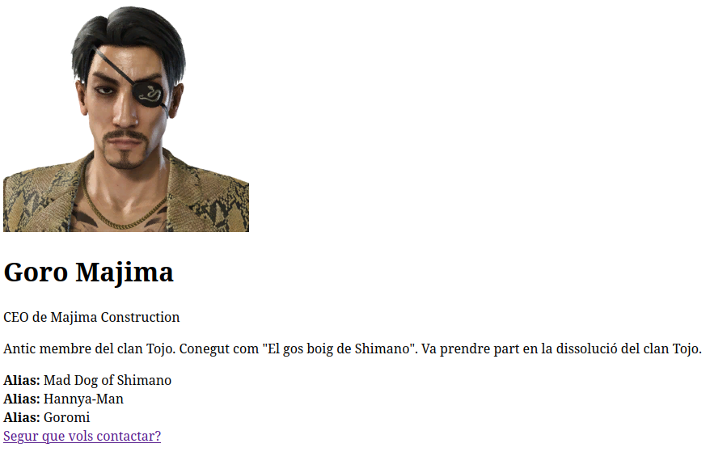
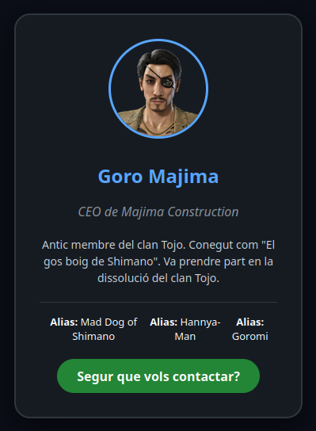

# Exercici: CSS

# Enunciat

Hem començat a treballar en una empresa de desenvolupament web i el primer encàrrec es una mica extrany.

Volen fer unes tarjes pels membres de la yakuza, pero sembla que els ha quedat el resultat una mica pla.

Ens donen aquest contingut `html` amb el que treballar.

```html
<!DOCTYPE html>
<html lang="ca">
<head>
    <meta charset="UTF-8">
    <meta name="viewport" content="width=device-width, initial-scale=1.0">
    <title>Tarja de membre de la yakuza</title>
    <link rel="stylesheet" href="style.css">
</head>
<body>

    <div class="card">
        
        
        <h1 class="name">Goro Majima</h1>
        <p class="role">CEO de Majima Construction</p>
        
        <div class="bio">
            <p>Antic membre del clan Tojo. Conegut com "El gos boig de Shimano". Va prendre part en la dissolució del clan Tojo.</p>
        </div>

        <div class="stats">
            <div class="stat-item"><strong>Alias:</strong> Mad Dog of Shimano</div>
            <div class="stat-item"><strong>Alias:</strong> Hannya-Man</div>
            <div class="stat-item"><strong>Alias:</strong> Goromi</div>
        </div>

        <a href="#" class="btn-contact">Segur que vols contactar?</a>
    </div>

</body>
</html>
```

Veient l'etiqueta `<link rel="stylesheet" href="style.css">` veiem que algú ha previst fer servir CSS pero el fitxer no hi és.

Si obrim el document a un navegador ens trobem un disseny tan trist com aquest:



Com que no volem enfrontar-nos a l'actitud que pugui tenir el nostre peculiar client si li presentem aixó, haurem de definir nosaltres mateixos el CSS per que el disseny quedi com el prototip inicial que tenim aquí.

