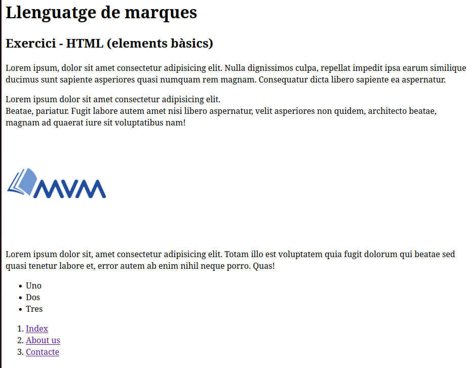

# Exercici HTML: Elements bàsics

## Exemple
A continuació teniu una captura de pantalla d'una pàgina web:

## Exercici

Crea un document HTML5 que es mostri el més similar possible a la imatge anterior i tenint en compte que hi han d’aparèixer els següents elements:

- Capçaleres (headings) de nivell 1 i nivell 2
- Paràgrafs
- Imatge
- Llistes (numerades i no numerades)
- Enllaços
