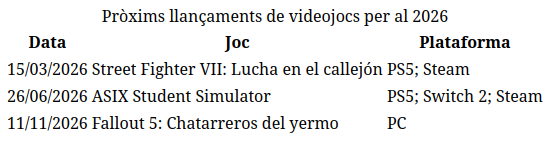
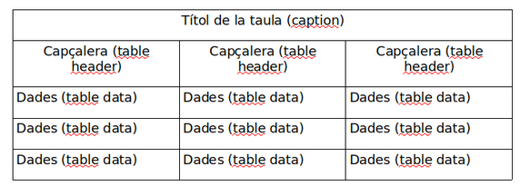

# Exercici HTML: Taules

## Exemple
A continuació es mostra una captura de pantalla d’ una taula `HTML` on podem observar els següents elements:
    
- Títol (`caption`)
- Files de taula (`tr`)
- Capçaleres de taula (`th`)
- Dades de taula (`td`)

El següent esquema representa l’estructura de la taula anterior perquè entenguis com està construïda (no 	té marges negres, tan sols s’han pintat perquè s’entengui millor):

## Exercici

Fes servir `HTML5` per a crear una taula com la que es mostra a l’exemple anterior. Recorda que no cal perfilar-la de negre.
