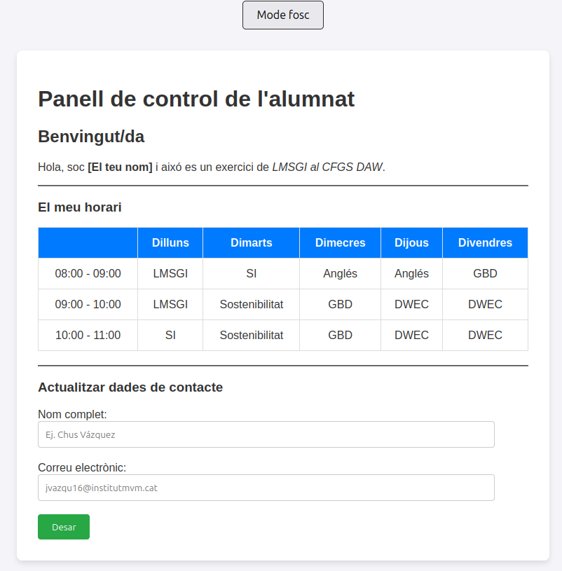
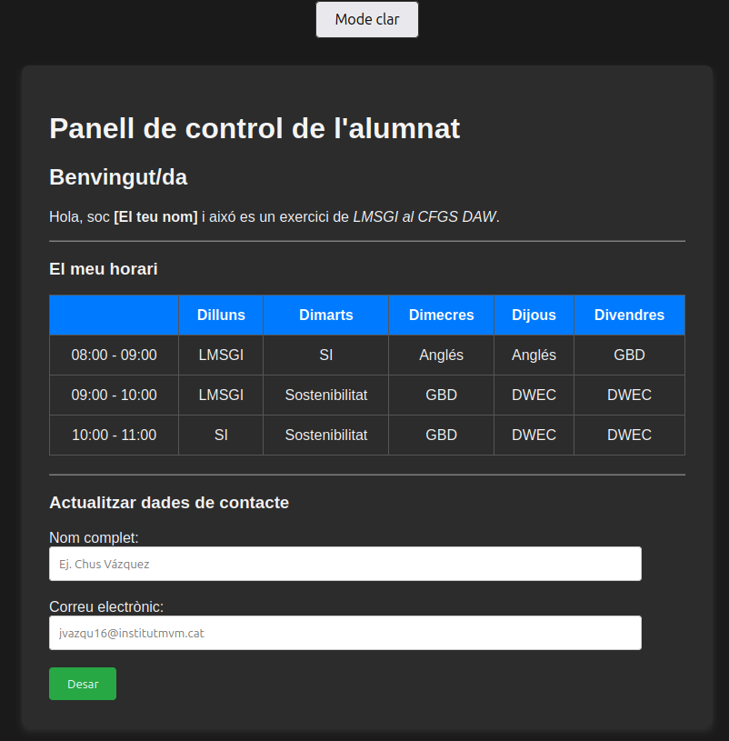

# Exercici: HTML + CSS + jQuery

Feu servir HTML, CSS i jQuery per elaborar una plana web similar a aquesta:

## Requeriments

Ha de constar dels següents elements:
- un fitxer `index.html` amb l'estructura sense estils
- un fitxer `styles.css` amb els estils a part
- un fitxer `script.js` amb l'interactivitat per canviar entre mode clar i mode fosc

Heu d'incloure:
- El vostre horari complet amb les diferents assignatures per colors (els que volgeu, pero que no facin mal a l'ull)
- Un petit formulari (no heu de recollir les dades pero sí validar-les):
    - Nom complet: Amb un text d'exemple i requerit
    - Correu electrònic: Amb un text d'exemple, requerit i validant que sigui un e-mail vàlid
    - Botó `Desar`

- Un botó per canviar entre el mode clar i el mode fosc de la pàgina: 
    - El seu text ha de canviar en funció del mode escollit
    - Al clicar el botó, els estils de la web canviaràn entre mode clar i mode fosc (fent servir jQuery)

