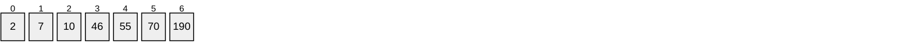
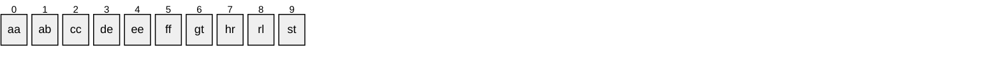

# Col.leccions o Estructures de dades

Als llenguatges de programació en general i a Python en particular disposem de diverses estructures de dades, també anomenades col.leccions, que ens ajuden a treballar de manera més fàcil, àgil i ordenada amb les dades.

## Llistes (`list`)

Una llista és una col·lecció **ordenada** i **mutable** d'elements. Imagineu-la com una prestatgeria separada en petits compartiments numerats del 0 en endavant. A aquest nº li diem `index`. Podem afegir i treure elements fent referència a ells amb el seu `index`.





Els elements poden ser els tipus de dades amb els que ja heu treballat. De maner que podem tenir una llista de `int`, `float`, `string`, `boolean`...

## Creació d'una llista

Podem definir manualment una llista i assignar-la a una variable de la següent manera

```python
llista_alumnes = ["Alejandro", "Paula", "Abdullah", "Kaw"]
```

## Accedir a un element

Per accedir a un element, hem de referència a la seva posició (`index`) a la llista.

```python
print(llista_alumnes[0]) #Mostrarà per pantalla "Alejandro"
print(llista_alumnes[1]) #Mostrarà per pantalla "Paula"
print(llista_alumnes[3]) #Mostrarà per pantalla "Kaw"
print(llista_alumnes[-1]) #Mostrarà per pantalla "Kaw" (-1 es fa servir per referir-nos a l'últim element)
print(llista_alumnes[4]) #Donarà un error del tipus: IndexError: list index out of range
```

## Modificar un element

També farem servir l'`index` per indicar quin element de la llista volem modificar

```python
llista_alumnes[0] = "Alejandra"
```

## Afegir un nou element amb `append`

Podem afegir nous elements al **final de la llista** fent servir `.append(element)`

```python
profes = ["Susana", "Dani", "Txema"]
print(profes) #Mostrarà per pantalla ['Susana', 'Dani', 'Txema']
profes.append("Chus") # Afegim l'element "Chus" al final de la llista
print(profes) #Mostrarà per pantalla ['Susana', 'Dani', 'Txema', 'Chus']
```
Més info a [aquí](https://www.w3schools.com/python/ref_list_append.asp)


## Inserir un nou element en una posició concreta amb `insert`

Podem inserir un nou element a una posició concreta fent servir `.insert(index, element)`

```python
profes = ["Susana", "Dani", "Txema"]
print(profes) #Mostrarà per pantalla ['Susana', 'Dani', 'Txema']
profes.insert(2, "Chus") # Inserim l'element "Chus" a la posició 2, desplaçant l'antic element, i els que vinguin darrera una posició,
print(profes) #Mostrarà per pantalla ['Susana', 'Dani', 'Chus', 'Txema']
```

Més info a [aquí](https://www.w3schools.com/python/ref_list_insert.asp)

## Eliminar un element amb `remove`

Podem eliminar elements en base al seu valor fent servir `.remove(valor)`
Si el valor existeix més d'una vegada, només eliminarà la primera ocurrència que trobi
Si el valor no existeix, donarà un error

```python
profes = ["Susana", "Dani", "Dani", "Txema"]
print(profes) #Mostrarà per pantalla ['Susana', 'Dani', 'Dani', 'Txema']
profes.remove("Dani")
print(profes) #Mostrarà per pantalla ['Susana', 'Dani', 'Txema']
profes.remove("Dani")
print(profes) #Mostrarà per pantalla ['Susana', 'Txema']
profes.remove("Dani") # ValueError: list.remove(x): x not in list
```

Més info a [aquí](https://www.w3schools.com/python/ref_list_remove.asp)

## Extreure i retornar un element amb `pop`

Podem eliminar i alhora retornar un element fent servir `.pop()` o `.pop(index)`

Si fem servir `.pop()` sempre eliminarem l'últim element de la llista

```python
profes = ["Susana", "Dani", "Txema"]
ultim = profes.pop()
print(ultim) #Mostrarà Txema
print(profes) #Mostrarà ['Susana', 'Dani']
```

Si fem servir `.pop(index)` eliminarà i retornarà l'element i reorganitzarà la resta

```python
profes = ["Susana", "Dani", "Txema"]
ultim = profes.pop(1)
print(ultim) #Mostrarà Dani
print(profes) #Mostrarà ['Susana', 'Txema']
```

Més info a [aquí](https://www.w3schools.com/python/ref_list_pop.asp)

## Ordenar la llista amb `sort`

Podem ordenar tots els elements de la llista, per defecte en ordre ascendent i alfanumèric, fent servir `.sort()`

```python
profes = ["Susana", "Dani", "Txema", "Chus"]
profes.sort()
print(profes) #Mostrarà ['Chus', 'Dani', 'Susana', 'Txema',]
```

Si volem que l'ordre sigui descendent ho podem indicar fent servir `.sort(reverse = True)`

Fins i tot podem personalitzar la lógica d'ordenació amb una funció propia

```python
def longitud_paraula(paraula):
    return len(paraula)
    
alumnes = ["Alejandro", "Paula", "Kaw", "Saad"]
alumnes.sort(key=longitud_paraula)
print(alumnes) #Mostrarà ['Kaw', 'Saad', 'Paula', 'Alejandro']
```

Més info a [aquí](https://www.w3schools.com/python/python_lists_sort.asp)
